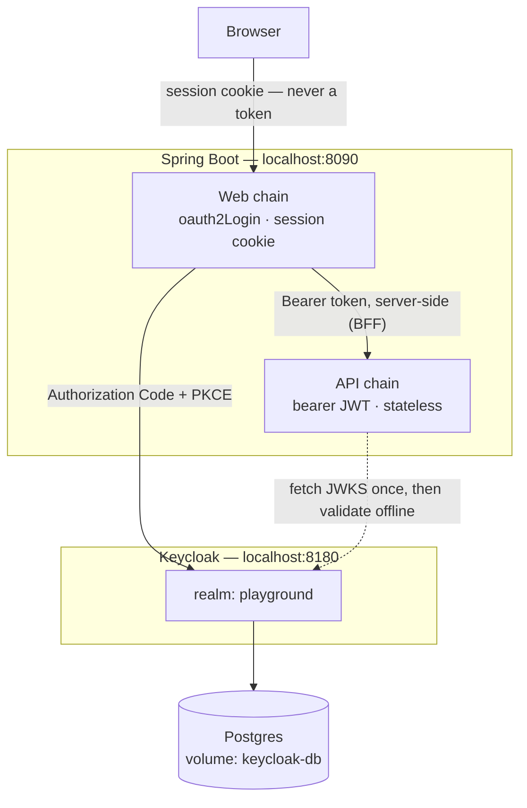

# Keycloak Playground

A hands-on lab for learning **Keycloak 26** with **Spring Boot 4.1** / **Spring Security 7**.

Not a starter template — a place to break things. Every file is commented with
*why*, not *what*, and the app deliberately exposes machinery that production
code hides.

> ⚠️ Every credential in this repo is a throwaway lab value (`admin/admin`,
> `spring-web-secret`, …), committed on purpose so the lab boots with one
> command. Nothing here is real, and nothing here should be copied into a real
> project.

## What makes it different

The app plays **both** OAuth2 roles at once. That's unusual in production, but it
puts the two halves of OAuth side by side where you can compare them:

| Path            | Role            | Style                                       |
| --------------- | --------------- | ------------------------------------------- |
| `/api/**`       | Resource server | Stateless · bearer JWT · 401 on failure     |
| everything else | OAuth2 client   | Session cookie · redirects to Keycloak      |



The dotted line is the point: the API talks to Keycloak **once**, to fetch public
keys. After that it validates every token locally and never phones home. That's
what makes it fast, and it's also why a disabled user keeps working for up to
five minutes.

## Quick start

```bash
./mvnw spring-boot:run
```

That's it. Spring Boot's `spring-boot-docker-compose` module starts
`compose.yaml` and blocks until Keycloak reports healthy. First boot pulls images
and imports the realm — give it ~90 seconds.

| What             | Where                                                       |
| ---------------- | ----------------------------------------------------------- |
| The app          | http://localhost:8090                                        |
| Token inspector  | http://localhost:8090/tokens ← **start here**                |
| Keycloak console | http://localhost:8180 · `admin` / `admin`                    |
| Discovery doc    | http://localhost:8180/realms/playground/.well-known/openid-configuration |

Ports 8090/8180 avoid the usual 8080/8081 collisions. To change them, update
`compose.yaml`, `application.yml` **and** the realm JSON together — redirect URIs
must match exactly or Keycloak refuses the login.

### Seeded identities

| User    | Password | Realm roles              | Use it to see       |
| ------- | -------- | ------------------------ | ------------------- |
| `alice` | `alice`  | `app-user`               | a 403               |
| `bob`   | `bob`    | `app-user`, `app-admin`  | a 200               |

| Client            | Type                       | Teaches                       |
| ----------------- | -------------------------- | ----------------------------- |
| `spring-web`      | Confidential, auth code    | Human login                   |
| `backend-service` | Confidential, svc account  | Machine-to-machine            |
| `spa-demo`        | Public, PKCE required      | Why public ≠ confidential     |

### Reset the lab

```bash
docker compose down -v && ./mvnw spring-boot:run
```

`-v` is load-bearing. It drops the volume and forces a re-import of
`docker/keycloak/import/playground-realm.json`. **Without `-v` the import is
silently skipped** — the strategy is `IGNORE_EXISTING`, so it never overwrites an
existing realm. That's the #1 reason "my realm edits didn't apply".

## Talks

[`docs/deck/`](docs/deck/) holds slide sources for talks generated out of this
repo &mdash; HTML per slide plus speaker notes, rendered to a real `.pptx` by the
`/ppt` pipeline. First one is
[`intro-to-keycloak`](docs/deck/intro-to-keycloak/) (12 slides): what a token is,
what it costs, and where every auth failure comes from.

## Branch layout

`main` holds the working baseline. Each concept we dig into gets its own branch,
numbered in the order we covered it, with a write-up under `docs/lessons/`:

```
main                                  the baseline playground
├── 001_authorization_code_flow       + /flow front-channel inspector
├── 002_<concept>
└── ...
```

Branches are cut from `main` and kept, not deleted — each one is a snapshot you
can `git switch` back to when you want to re-read how that concept was wired.

| Lesson | Branch | Adds |
| ------ | ------ | ---- |
| [001 — Authorization Code flow](docs/lessons/001-authorization-code-flow.md) | `001_authorization_code_flow` | `/flow`: renders the real authorization request instead of following it |

## Concept → code

The fastest way to navigate this repo. Every auth failure you debug is "which
stage did it exit at", so learn the stages:

| Stage                          | Where                                                                                       |
| ------------------------------ | ------------------------------------------------------------------------------------------- |
| Find Keycloak (OIDC discovery) | [application.yml:35](src/main/resources/application.yml#L35)                                 |
| Login flow (one line!)         | [SecurityConfig.java:86](src/main/java/lu/zakaria/keycloak/config/SecurityConfig.java#L86)   |
| Where tokens are stored        | [HomeController.java:59](src/main/java/lu/zakaria/keycloak/web/HomeController.java#L59)      |
| API chain split                | [SecurityConfig.java:54](src/main/java/lu/zakaria/keycloak/config/SecurityConfig.java#L54)   |
| Audience validation            | [application.yml:59](src/main/resources/application.yml#L59)                                 |
| Roles → authorities            | [KeycloakRealmRoles.java:46](src/main/java/lu/zakaria/keycloak/config/KeycloakRealmRoles.java#L46) |
| RP-initiated logout            | [SecurityConfig.java:99](src/main/java/lu/zakaria/keycloak/config/SecurityConfig.java#L99)   |
| Roles into the ID token        | [playground-realm.json:95](docker/keycloak/import/playground-realm.json#L95)                 |

### The two rules worth memorizing

**1. 401 vs 403.** 401 means "I don't know you" — it fires *before* identity
exists (missing token, bad signature, expired, wrong issuer, wrong audience).
403 means "I know you, and no" — it fires *after*, when the identity lacks a
role. The `WWW-Authenticate` header always names the exact stage.

**2. Claim missing → check Keycloak. Claim rejected → check Spring.** Java
decides what to *enforce*; Keycloak decides what's *in the token*. No amount of
Spring config conjures a claim a protocol mapper didn't emit.

### The bug everyone hits

Keycloak writes roles to `realm_access.roles`. Spring Security reads the flat
`scope` claim. **Nothing connects them by default**, so `hasRole("app-admin")`
returns false for an obvious admin — with no error logged anywhere.

It's wired twice in this repo, because the two chains build their
`Authentication` along different paths:

| Path  | Hook                        | Reads        |
| ----- | --------------------------- | ------------ |
| API   | `JwtAuthenticationConverter` | access token |
| Login | `GrantedAuthoritiesMapper`   | ID token     |

And there's a Keycloak-side half you'd never guess: roles go in the **access**
token, but `oauth2Login` only reads the **ID** token. The realm adds a
`realm-roles-into-id-token` protocol mapper specifically to close that gap.

> Try it: comment out `userAuthoritiesMapper()`, restart, log in as bob, hit
> `/admin`. Silent 403. Feeling that once saves you a day later.

## Things that already bit us

- `postgres:18+` wants the volume at `/var/lib/postgresql`, **not**
  `/var/lib/postgresql/data`. The old path makes the image refuse to boot.
- The Keycloak image ships no `curl`/`wget` — the healthcheck uses bash `/dev/tcp`.
- Spring Boot 4 moved `RestClient.Builder` out of the web starter into
  `spring-boot-starter-restclient`.
- Spring Initializr's legacy metadata reports `4.1.0.RELEASE`; the real Maven
  artifact is `4.1.0`.
- `issuer-uri` is fetched **eagerly at startup**, so the app won't boot with
  Keycloak down. Tests spell the endpoints out instead — see
  [src/test/resources/application.yml](src/test/resources/application.yml).
- `ApiCallController` reads the stored token directly and does **not** refresh.
  Production uses `OAuth2AuthorizedClientManager`, which refreshes silently — and
  hides exactly the mechanism this lab wants you to see.

## Stack

Spring Boot 4.1.0 · Spring Security 7.1.0 · Java 25 · Jackson 3 · Keycloak 26.7 ·
Postgres 18
